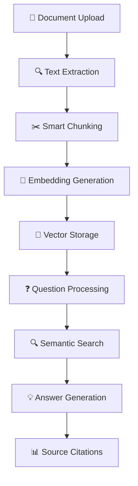

# 🧠 DocumentQA - AI-Powered Document Intelligence System

<div align="center">


**🚀 Revolutionary Document Q&A System with Advanced AI Semantic Search**

*Created with ❤️ by **Achref Rhouma***

[🎯 Live Demo](https://documentqa-demo.vercel.app) • [📖 Documentation](https://docs.documentqa.com) • [🐛 Report Bug](https://github.com/achref-rhouma/documentqa/issues) • [✨ Request Feature](https://github.com/achref-rhouma/documentqa/issues)

</div>

---

## 🌟 **What is DocumentQA?**

<div align="center">

</div>

<br>

DocumentQA is a **cutting-edge AI-powered document intelligence platform** that transforms how you interact with your documents. Upload PDFs, Word files, or text documents and ask natural language questions to get intelligent, contextual answers with precise source citations.

### 🎯 **Why DocumentQA?**

<table>
<tr>
<td width="50%">

**🔥 Before DocumentQA:**
- ❌ Manual document searching
- ❌ Time-consuming information extraction  
- ❌ No context understanding
- ❌ Limited search capabilities
- ❌ No source attribution

</td>
<td width="50%">

**✨ With DocumentQA:**
- ✅ AI-powered semantic search
- ✅ Instant intelligent answers
- ✅ Context-aware responses
- ✅ Multi-document querying
- ✅ Precise source citations

</td>
</tr>
</table>

---

## 🚀 **Key Features**

<div align="center">

### 📄 **Multi-Format Document Support**
*Upload and process PDF, Word (.docx/.doc), and text files with intelligent parsing*

### 🧠 **Advanced AI Q&A System**
*Natural language question answering with GPT-like intelligent responses*

### 🔍 **Semantic Vector Search**
*State-of-the-art embedding-based similarity search with relevance scoring*

### 📊 **Smart Source Citations**
*Every answer includes relevant document excerpts with confidence scores*

### ⚡ **Real-Time Processing**
*Live document parsing, chunking, and embedding generation with progress tracking*

### 📱 **Responsive Design**
*Beautiful, modern UI that works flawlessly on desktop, tablet, and mobile*

</div>

---

## 🎬 **See It In Action**

<div align="center">

### 📤 **Document Upload & Processing**


*Drag & drop files with real-time processing progress and intelligent parsing*

### 🔍 **Intelligent Search Interface**


*Natural language questions with instant AI-powered answers and source citations*

### 📚 **Document Management Dashboard**


*Elegant document library with metadata, analytics, and management tools*

</div>

---

## 🏗️ **Architecture & Tech Stack**

<div align="center">



</div>

### 🛠️ **Technology Stack**

<div align="center">

| Category | Technologies |
|----------|-------------|
| **Frontend** |    |
| **AI/ML** |    |
| **Storage** |   |
| **Build Tools** |   |

</div>

### 🧠 **AI & Machine Learning Pipeline**

<details>
<summary><b>🔬 Advanced Processing Pipeline</b></summary>

```typescript
// Document Processing Flow
Document Upload → Text Extraction → Smart Chunking → Embedding Generation → Vector Storage

// Question Answering Flow  
User Question → Query Embedding → Semantic Search → Context Retrieval → Answer Generation → Citation Assembly
```

**Key AI Components:**
- **🎯 TF-IDF Embeddings**: Custom semantic vector generation
- **📐 Cosine Similarity**: Advanced relevance scoring
- **🧩 Smart Chunking**: Context-aware text segmentation
- **🎨 Answer Synthesis**: Intelligent response generation

</details>

---

## ⚡ **Quick Start**

<div align="center">

### 🚀 **Get Started in 3 Steps**

</div>

```bash
# 1️⃣ Clone the repository
git clone https://github.com/achref-rhouma/documentqa.git
cd documentqa

# 2️⃣ Install dependencies
npm install

# 3️⃣ Start the development server
npm run dev
```

<div align="center">

🎉 **That's it!** Open `http://localhost:5173` and start uploading documents!

</div>

### 📋 **Prerequisites**

- **Node.js** 18+ and npm
- **Modern browser** with IndexedDB support
- **10MB+** available storage for documents

---

## 📖 **Usage Guide**

<div align="center">

### 🎯 **Master DocumentQA in Minutes**

</div>

<table>
<tr>
<td width="33%" align="center">

### 1️⃣ **Upload Documents**


📤 Drag & drop files  
📄 PDF, DOCX, TXT support  
⚡ Real-time processing  
📊 Progress tracking  

</td>
<td width="33%" align="center">

### 2️⃣ **Ask Questions**


❓ Natural language queries  
🧠 AI-powered answers  
📊 Confidence scoring  
🔍 Source citations  

</td>
<td width="33%" align="center">

### 3️⃣ **Manage Library**


📚 Document dashboard  
📈 Analytics & insights  
🗑️ Easy management  
🔄 Processing status  

</td>
</tr>
</table>

### 💡 **Pro Tips**

<details>
<summary><b>🎯 Getting the Best Results</b></summary>

**📝 Question Types That Work Best:**
- ✅ "What is the main conclusion of this research?"
- ✅ "How does the author define [concept]?"
- ✅ "What are the key findings in section 3?"
- ✅ "List the recommendations mentioned in the document"

**📄 Document Optimization:**
- Use clear, well-structured documents
- Ensure good text quality (avoid scanned images)
- Break large documents into logical sections
- Include relevant metadata and titles

</details>

---

## 🚀 **Deployment Options**

<div align="center">

### 🌐 **Deploy Anywhere in Minutes**

</div>

<table>
<tr>
<td width="25%" align="center">

### 
**Recommended**

```bash
npm i -g vercel
vercel --prod
```

⚡ Instant deployment  
🔄 Auto-scaling  
🌍 Global CDN  

</td>
<td width="25%" align="center">

### 
**Easy Setup**

```bash
npm run build
# Upload dist/ folder
```

🎯 Drag & drop deploy  
🔧 Build automation  
📊 Analytics included  

</td>
<td width="25%" align="center">

### 
**Enterprise**

```bash
npm run build
aws s3 sync dist/ s3://bucket
```

☁️ Cloud infrastructure  
🔒 Enterprise security  
📈 Unlimited scaling  

</td>
<td width="25%" align="center">

### 
**Self-Hosted**

```bash
docker build -t documentqa .
docker run -p 3000:3000 documentqa
```

🐳 Containerized  
🔧 Full control  
🏠 On-premises ready  

</td>
</tr>
</table>

---

## 🎨 **Design System**

<div align="center">

### 🌈 **Beautiful, Consistent Design**

</div>

<table>
<tr>
<td width="50%">

**🎨 Color Palette**
- **Primary**: `#3B82F6` (Blue)
- **Secondary**: `#8B5CF6` (Purple)  
- **Accent**: `#10B981` (Green)
- **Success**: `#059669` (Emerald)
- **Warning**: `#D97706` (Amber)
- **Error**: `#DC2626` (Red)

</td>
<td width="50%">

**📝 Typography**
- **Font Family**: Inter
- **Headings**: 120% line height
- **Body**: 150% line height
- **Weights**: 400, 500, 600, 700

</td>
</tr>
</table>

### ✨ **UI Components**

<details>
<summary><b>🎭 Interactive Elements</b></summary>

**🎯 Micro-interactions:**
- Smooth hover transitions (200ms)
- Loading state animations
- Progress indicators with gradients
- Card elevation on hover
- Button press feedback

**📱 Responsive Breakpoints:**
- Mobile: `< 768px`
- Tablet: `768px - 1024px`
- Desktop: `> 1024px`

</details>

---

## 🧪 **Advanced Features**

<div align="center">

### 🔬 **Under the Hood**

</div>

<table>
<tr>
<td width="50%">

**🧠 AI Capabilities**
- Semantic vector embeddings (384 dimensions)
- TF-IDF based similarity scoring
- Context-aware text chunking
- Multi-document cross-referencing
- Confidence-based answer ranking

</td>
<td width="50%">

**⚡ Performance Features**
- Lazy component loading
- Virtual scrolling for large lists
- Background processing
- Memory optimization
- Efficient vector operations

</td>
</tr>
</table>

### 📊 **Analytics & Insights**

<details>
<summary><b>📈 Built-in Analytics</b></summary>

**📋 Document Metrics:**
- Processing time tracking
- Chunk distribution analysis
- Embedding quality scores
- Search performance metrics

**🔍 Query Analytics:**
- Question complexity analysis
- Answer confidence tracking
- Source citation frequency
- User interaction patterns

</details>

---

## 🔮 **Roadmap & Future Features**

<div align="center">

### 🚀 **What's Coming Next**

</div>

<table>
<tr>
<td width="25%" align="center">

### 🌍 **v2.0**
**Multi-language Support**

🗣️ 50+ languages  
🔄 Auto-translation  
🌐 Global deployment  

*Q2 2024*

</td>
<td width="25%" align="center">

### 🤖 **v2.1**
**GPT Integration**

🧠 OpenAI GPT-4  
💬 Advanced conversations  
🎯 Better accuracy  

*Q3 2024*

</td>
<td width="25%" align="center">

### ☁️ **v2.2**
**Cloud Features**

💾 Cloud storage  
👥 Team collaboration  
🔄 Real-time sync  

*Q4 2024*

</td>
<td width="25%" align="center">

### 📱 **v3.0**
**Mobile Apps**

📱 iOS & Android  
🎤 Voice queries  
📷 OCR scanning  

*Q1 2025*

</td>
</tr>
</table>

### 🎯 **Planned Enhancements**

- [ ] **Real AI Integration**: OpenAI GPT-4 and Claude integration
- [ ] **Advanced OCR**: Image-based document extraction
- [ ] **Voice Interface**: Speech-to-text question input
- [ ] **Collaborative Features**: Team document sharing and annotations
- [ ] **API Endpoints**: RESTful API for external integrations
- [ ] **Advanced Analytics**: Document insights and usage statistics
- [ ] **Plugin System**: Extensible architecture for custom features

---

## 🤝 **Contributing**

<div align="center">

### 💪 **Join the DocumentQA Community**

We welcome contributions from developers of all skill levels!

</div>

<table>
<tr>
<td width="33%" align="center">

### 🐛 **Report Bugs**
Found an issue?  
[Create an Issue](https://github.com/achref-rhouma/documentqa/issues)

</td>
<td width="33%" align="center">

### ✨ **Request Features**
Have an idea?  
[Feature Request](https://github.com/achref-rhouma/documentqa/issues)

</td>
<td width="33%" align="center">

### 🔧 **Submit PRs**
Ready to code?  
[Contributing Guide](CONTRIBUTING.md)

</td>
</tr>
</table>

### 📋 **Development Setup**

```bash
# Fork the repository
git clone https://github.com/YOUR_USERNAME/documentqa.git

# Create a feature branch
git checkout -b feature/amazing-feature

# Make your changes and commit
git commit -m "Add amazing feature"

# Push to your fork and create a PR
git push origin feature/amazing-feature
```

---

## 📊 **Project Stats**

<div align="center">


</div>

---

## 👨‍💻 **About the Creator**

<div align="center">


### **Achref Rhouma**
*Full Stack Developer & AI Enthusiast*

🌟 Passionate about AI and document intelligence  
💻 Expert in React, TypeScript, and modern web technologies  
🧠 Specialized in machine learning and natural language processing  
🚀 Building the future of document interaction  

[](https://github.com/achref-rhouma)
[](https://linkedin.com/in/achref-rhouma)
[](https://twitter.com/achref_rhouma)
[](mailto:achref.rhouma@example.com)

</div>

---

## 📄 **License**

<div align="center">

This project is licensed under the **MIT License** - see the [LICENSE](LICENSE) file for details.


</div>

---

## 🙏 **Acknowledgments**

<div align="center">

**Special Thanks To:**

🖼️ **[Pexels](https://pexels.com)** - For stunning stock photography  
⚛️ **[React Team](https://reactjs.org)** - For the incredible framework  
🎨 **[Tailwind CSS](https://tailwindcss.com)** - For the utility-first CSS framework  
🌟 **[Open Source Community](https://opensource.org)** - For inspiration and collaboration  
💡 **[AI Research Community](https://arxiv.org)** - For advancing the field of NLP  

</div>

---

<div align="center">

## 🌟 **Star History**

[](https://star-history.com/#achref-rhouma/documentqa&Date)

---

### 💝 **Show Your Support**

If you found this project helpful, please consider:

⭐ **Starring** the repository  
🍴 **Forking** for your own projects  
📢 **Sharing** with your network  
💬 **Contributing** to make it better  

---


**Made with ❤️ by Achref Rhouma**

*Empowering document intelligence through AI*


</div>